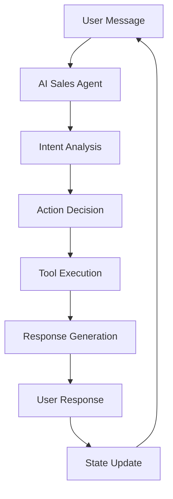

# AI Sales Agent Implementation for TokenGoblin Bot

## Overview

This document provides a complete implementation of an AI-powered sales agent that can orchestrate token purchases through natural conversation, making traditional handlers optional while maintaining the existing business logic.

## Architecture

### 1. Core Components

```
TokenGoblin/
├── services/
│   ├── agentic_orchestrator.py    # Main AI agent orchestrator
│   ├── ai_sales_agent.py          # AI sales persona logic
│   └── conversation_manager.py     # Conversation state management
├── tools/
│   ├── pricing_tools.py           # Pricing and quotation tools
│   ├── payment_tools.py           # Payment processing tools
│   └── delivery_tools.py          # Token delivery tools
└── models/
    ├── conversation.py             # Conversation state models
    └── agent_actions.py           # AI agent action definitions
```

### 2. Data Flow



## Implementation Details

### 1. AI Sales Agent Service

```python
# services/ai_sales_agent.py

import asyncio
import logging
from typing import Dict, Any, List
from openai import AsyncOpenAI
import config
from models.conversation import ConversationState
from tools.pricing_tools import PricingTools
from tools.payment_tools import PaymentTools
from tools.delivery_tools import DeliveryTools

class AISalesAgent:
    def __init__(self):
        self.client = AsyncOpenAI(
            api_key=config.OPENROUTER_API_KEY,
            base_url="https://openrouter.ai/api/v1"
        )
        self.pricing_tools = PricingTools()
        self.payment_tools = PaymentTools()
        self.delivery_tools = DeliveryTools()
        
    async def process_message(
        self, 
        user_id: int, 
        message: str, 
        conversation_state: ConversationState
    ) -> Dict[str, Any]:
        """
        Process user message and return AI response with actions
        """
        # Build system prompt with available tools
        system_prompt = self._build_system_prompt()
        
        # Prepare conversation context
        messages = self._prepare_conversation_context(
            conversation_state, message
        )
        
        # Call OpenRouter with function calling
        response = await self.client.chat.completions.create(
            model="anthropic/claude-3-sonnet",
            messages=messages,
            tools=self._get_available_tools(),
            tool_choice="auto"
        )
        
        # Process response and execute actions
        return await self._process_ai_response(response, user_id)
    
    def _build_system_prompt(self) -> str:
        return """
        You are an AI sales agent for TokenGoblin, a cryptocurrency token purchasing bot.
        
        Your role:
        - Help users purchase AI tokens through natural conversation
        - Provide pricing information and quotations
        - Process payments and deliver tokens
        - Answer questions about services and pricing
        - Maintain a friendly, professional tone
        
        Available actions:
        - get_pricing: Get current token prices and calculate costs
        - create_payment: Generate payment links and instructions
        - check_payment: Verify payment status
        - deliver_tokens: Deliver purchased tokens to user
        - get_user_info: Retrieve user account information
        
        Always be helpful, accurate, and professional. If you're unsure about something,
        ask for clarification rather than making assumptions.
        """
    
    def _prepare_conversation_context(
        self, 
        conversation_state: ConversationState, 
        message: str
    ) -> List[Dict[str, str]]:
        """
        Prepare conversation context for AI
        """
        messages = [
            {"role": "system", "content": self._build_system_prompt()}
        ]
        
        # Add conversation history if available
        if conversation_state.context.get('message_history'):
            for msg in conversation_state.context['message_history'][-5:]:  # Last 5 messages
                messages.append(msg)
        
        # Add current message
        messages.append({"role": "user", "content": message})
        
        return messages
    
    def _get_available_tools(self) -> List[Dict]:
        return [
            {
                "type": "function",
                "function": {
                    "name": "get_pricing",
                    "description": "Get current token pricing and calculate costs",
                    "parameters": {
                        "type": "object",
                        "properties": {
                            "token_amount": {
                                "type": "integer",
                                "description": "Number of tokens requested"
                            },
                            "currency": {
                                "type": "string",
                                "enum": ["USD", "USDT", "BTC", "ETH"],
                                "description": "Preferred currency"
                            }
                        },
                        "required": ["token_amount"]
                    }
                }
            },
            {
                "type": "function",
                "function": {
                    "name": "create_payment",
                    "description": "Create payment request and generate payment link",
                    "parameters": {
                        "type": "object",
                        "properties": {
                            "token_amount": {
                                "type": "integer",
                                "description": "Number of tokens to purchase"
                            },
                            "payment_method": {
                                "type": "string",
                                "enum": ["crypto", "fiat"],
                                "description": "Payment method preference"
                            },
                            "user_id": {
                                "type": "integer",
                                "description": "User ID for payment tracking"
                            }
                        },
                        "required": ["token_amount", "user_id"]
                    }
                }
            },
            {
                "type": "function",
                "function": {
                    "name": "check_payment",
                    "description": "Check payment status for a given payment ID",
                    "parameters": {
                        "type": "object",
                        "properties": {
                            "payment_id": {
                                "type": "string",
                                "description": "Payment ID to check"
                            }
                        },
                        "required": ["payment_id"]
                    }
                }
            },
            {
                "type": "function",
                "function": {
                    "name": "deliver_tokens",
                    "description": "Deliver purchased tokens to user",
                    "parameters": {
                        "type": "object",
                        "properties": {
                            "payment_id": {
                                "type": "string",
                                "description": "Payment ID for token delivery"
                            },
                            "user_id": {
                                "type": "integer",
                                "description": "User ID to deliver tokens to"
                            }
                        },
                        "required": ["payment_id", "user_id"]
                    }
                }
            }
        ]
    
    async def _process_ai_response(
        self, 
        response: Any, 
        user_id: int
    ) -> Dict[str, Any]:
        """
        Process AI response and execute any tool calls
        """
        message = response.choices[0].message
        tool_calls = message.tool_calls if hasattr(message, 'tool_calls') else []
        
        results = []
        state_updates = {}
        
        # Execute tool calls
        for tool_call in tool_calls:
            function_name = tool_call.function.name
            arguments = tool_call.function.arguments
            
            # Parse arguments
            import json
            args = json.loads(arguments)
            
            # Execute tool
            if function_name == "get_pricing":
                result = await self.pricing_tools.get_pricing(
                    args.get("token_amount"),
                    args.get("currency", "USD")
                )
                results.append(result)
                state_updates["pricing_info"] = result
                
            elif function_name == "create_payment":
                result = await self.payment_tools.create_payment(
                    args.get("token_amount"),
                    user_id,
                    args.get("payment_method", "crypto")
                )
                results.append(result)
                if result.get("success"):
                    state_updates["payment_id"] = result.get("payment_id")
                    
            elif function_name == "check_payment":
                result = await self.payment_tools.check_payment(
                    args.get("payment_id")
                )
                results.append(result)
                
            elif function_name == "deliver_tokens":
                result = await self.delivery_tools.deliver_tokens(
                    args.get("payment_id"),
                    user_id
                )
                results.append(result)
        
        # Build response message
        response_message = message.content or ""
        
        # Add tool results to response
        for result in results:
            if result.get("message"):
                response_message += "\n\n" + result["message"]
        
        return {
            "message": response_message,
            "state_updates": state_updates,
            "actions": results
        }
```

### 2. Tool Implementations

```python
# tools/pricing_tools.py

import logging
from typing import Dict, Any
from services.ai_token_service import AITokenService

class PricingTools:
    def __init__(self):
        self.token_service = AITokenService()
    
    async def get_pricing(self, token_amount: int, currency: str = "USD") -> Dict[str, Any]:
        """
        Get pricing information for requested tokens
        """
        try:
            # Get current pricing from OpenRouter
            pricing_info = await self.token_service.get_token_pricing(token_amount)
            
            # Calculate costs in different currencies
            usd_cost = pricing_info.get('total_cost_usd', 0)
            
            return {
                "success": True,
                "token_amount": token_amount,
                "usd_cost": usd_cost,
                "crypto_cost": pricing_info.get('crypto_amount', 0),
                "currency": currency,
                "pricing_breakdown": pricing_info.get('breakdown', {}),
                "message": f"💰 **Pricing for {token_amount:,} tokens:**\n"
                          f"• USD Cost: ${usd_cost:.2f}\n"
                          f"• Crypto Cost: {pricing_info.get('crypto_amount', 0):.6f} USDT\n"
                          f"• Includes all fees and processing\n\n"
                          f"Would you like to proceed with the purchase?"
            }
        except Exception as e:
            logging.error(f"Error getting pricing: {e}")
            return {
                "success": False,
                "error": "Unable to get pricing at this time. Please try again later.",
                "message": "❌ Sorry, I'm having trouble getting pricing information right now. Please try again in a moment."
            }

# tools/payment_tools.py

import uuid
import logging
from typing import Dict, Any
from services.payment import PaymentService
from models.payment import ProcessingPaymentDTO

class PaymentTools:
    def __init__(self):
        self.payment_service = PaymentService()
    
    async def create_payment(
        self, 
        token_amount: int, 
        user_id: int, 
        payment_method: str = "crypto"
    ) -> Dict[str, Any]:
        """
        Create payment request and generate payment link
        """
        try:
            # Generate unique payment ID
            payment_id = f"pay_{uuid.uuid4().hex[:12]}"
            
            # Create payment DTO
            payment_dto = ProcessingPaymentDTO(
                id=None,
                paymentType="DEPOSIT",
                fiatCurrency="USD",
                fiatAmount=0,  # Will be calculated
                cryptoCurrency="USDT_TRC20",
                cryptoAmount=0,  # Will be calculated
                userId=user_id,
                paymentId=payment_id,
                status="PENDING"
            )
            
            # Process payment creation
            result = await self.payment_service.create_payment(payment_dto)
            
            if result.get('success'):
                return {
                    "success": True,
                    "payment_id": payment_id,
                    "payment_link": result.get('payment_url'),
                    "qr_code": result.get('qr_code'),
                    "amount": result.get('amount'),
                    "message": f"💳 **Payment Created!**\n\n"
                              f"Payment ID: `{payment_id}`\n"
                              f"Amount: {result.get('amount')} USDT\n\n"
                              f"Please send the payment to complete your token purchase.\n"
                              f"Payment link: {result.get('payment_url')}"
                }
            else:
                return {
                    "success": False,
                    "error": result.get('error'),
                    "message": "❌ Unable to create payment. Please try again."
                }
                
        except Exception as e:
            logging.error(f"Error creating payment: {e}")
            return {
                "success": False,
                "error": str(e),
                "message": "❌ Payment creation failed. Please try again later."
            }
    
    async def check_payment(self, payment_id: str) -> Dict[str, Any]:
        """
        Check payment status
        """
        try:
            # Check payment status via service
            status = await self.payment_service.check_payment_status(payment_id)
            
            return {
                "success": True,
                "payment_id": payment_id,
                "status": status.get('status'),
                "confirmed": status.get('confirmed', False),
                "message": f"📊 **Payment Status:** {status.get('status', 'UNKNOWN')}\n"
                          f"Payment ID: `{payment_id}`"
            }
        except Exception as e:
            logging.error(f"Error checking payment: {e}")
            return {
                "success": False,
                "error": str(e),
                "message": "❌ Unable to check payment status. Please try again."
            }

# tools/delivery_tools.py

import logging
from typing import Dict, Any
from services.ai_token_service import AITokenService

class DeliveryTools:
    def __init__(self):
        self.token_service = AITokenService()
    
    async def deliver_tokens(
        self, 
        payment_id: str, 
        user_id: int
    ) -> Dict[str, Any]:
        """
        Deliver tokens to user after payment confirmation
        """
        try:
            # Process token delivery
            result = await self.token_service.deliver_tokens(payment_id, user_id)
            
            if result.get('success'):
                return {
                    "success": True,
                    "payment_id": payment_id,
                    "user_id": user_id,
                    "token_amount": result.get('token_amount'),
                    "message": f"🎉 **Tokens Delivered!**\n\n"
                              f"Your {result.get('token_amount'):,} tokens have been successfully "
                              f"delivered to your account.\n\n"
                              f"You can now use them for your AI projects!"
                }
            else:
                return {
                    "success": False,
                    "error": result.get('error'),
                    "message": "❌ Token delivery failed. Please contact support."
                }
                
        except Exception as e:
            logging.error(f"Error delivering tokens: {e}")
            return {
                "success": False,
                "error": str(e),
                "message": "❌ Token delivery failed. Please try again later."
            }
```

### 3. Conversation State Management

```python
# models/conversation.py

from pydantic import BaseModel
from typing import Dict, Any, Optional
from datetime import datetime

class ConversationState(BaseModel):
    user_id: int
    session_id: str
    current_step: str = "initial"
    context: Dict[str, Any] = {}
    last_message_time: datetime
    payment_id: Optional[str] = None
    token_amount: Optional[int] = None
    pricing_info: Optional[Dict[str, Any]] = None
    
    class Config:
        from_attributes = True

# services/conversation_manager.py

import asyncio
from typing import Dict, Optional
from models.conversation import ConversationState
from datetime import datetime, timedelta

class ConversationManager:
    def __init__(self):
        self.active_conversations: Dict[int, ConversationState] = {}
        self.session_timeout = timedelta(minutes=30)
    
    async def get_or_create_conversation(self, user_id: int) -> ConversationState:
        """
        Get existing conversation or create new one
        """
        if user_id in self.active_conversations:
            conv = self.active_conversations[user_id]
            # Check if session is still valid
            if datetime.now() - conv.last_message_time < self.session_timeout:
                conv.last_message_time = datetime.now()
                return conv
        
        # Create new conversation
        new_conv = ConversationState(
            user_id=user_id,
            session_id=f"session_{user_id}_{datetime.now().timestamp()}",
            last_message_time=datetime.now()
        )
        self.active_conversations[user_id] = new_conv
        return new_conv
    
    async def update_conversation_state(
        self, 
        user_id: int, 
        **updates
    ) -> ConversationState:
        """
        Update conversation state with new information
        """
        conv = await self.get_or_create_conversation(user_id)
        
        for key, value in updates.items():
            if hasattr(conv, key):
                setattr(conv, key, value)
        
        conv.last_message_time = datetime.now()
        return conv
    
    async def clear_conversation(self, user_id: int):
        """
        Clear conversation state for user
        """
        if user_id in self.active_conversations:
            del self.active_conversations[user_id]
```

### 4. Main Orchestrator Service

```python
# services/agentic_orchestrator.py

import asyncio
import logging
from typing import Dict, Any
from services.ai_sales_agent import AISalesAgent
from services.conversation_manager import ConversationManager
from services.notification import NotificationService

class AgenticOrchestrator:
    def __init__(self):
        self.ai_agent = AISalesAgent()
        self.conversation_manager = ConversationManager()
        self.notification_service = NotificationService()
    
    async def handle_user_message(
        self, 
        user_id: int, 
        message: str
    ) -> Dict[str, Any]:
        """
        Main entry point for handling user messages
        """
        try:
            # Get or create conversation state
            conversation_state = await self.conversation_manager.get_or_create_conversation(user_id)
            
            # Process message with AI agent
            ai_response = await self.ai_agent.process_message(
                user_id, message, conversation_state
            )
            
            # Update conversation state based on AI response
            if ai_response.get('state_updates'):
                await self.conversation_manager.update_conversation_state(
                    user_id, **ai_response['state_updates']
                )
            
            # Handle any side effects (notifications, etc.)
            if ai_response.get('side_effects'):
                await self._handle_side_effects(ai_response['side_effects'])
            
            return {
                "success": True,
                "response": ai_response.get('message', ''),
                "actions": ai_response.get('actions', []),
                "conversation_state": conversation_state
            }
            
        except Exception as e:
            logging.error(f"Error in orchestrator: {e}")
            return {
                "success": False,
                "error": "I'm having trouble processing your request. Please try again.",
                "fallback_to_handler": True
            }
    
    async def _handle_side_effects(self, side_effects: Dict[str, Any]):
        """
        Handle side effects from AI agent actions
        """
        for effect_type, effect_data in side_effects.items():
            if effect_type == "payment_confirmed":
                # Notify user of payment confirmation
                await self.notification_service.payment_confirmed(
                    effect_data['user_id'],
                    effect_data['payment_id']
                )
            elif effect_type == "tokens_delivered":
                # Notify user of token delivery
                await self.notification_service.tokens_delivered(
                    effect_data['user_id'],
                    effect_data['token_amount']
                )
```

### 5. Integration with Existing Bot

```python
# bot.py (modified)

from services.agentic_orchestrator import AgenticOrchestrator
from handlers.user.cart import CartHandler  # Fallback handlers

class TokenGoblinBot:
    def __init__(self):
        self.orchestrator = AgenticOrchestrator()
        self.fallback_handlers = {
            'cart': CartHandler(),
            # Add other handlers as fallbacks
        }
    
    async def handle_message(self, user_id: int, message: str):
        """
        Handle incoming user message
        """
        # Try AI agent first
        ai_response = await self.orchestrator.handle_user_message(user_id, message)
        
        if ai_response.get('success'):
            # AI agent handled it successfully
            return ai_response['response']
        else:
            # Fallback to traditional handlers
            return await self._handle_with_fallback(user_id, message)
    
    async def _handle_with_fallback(self, user_id: int, message: str):
        """
        Fallback to traditional handlers if AI agent fails
        """
        # Determine which handler to use based on message content
        if any(keyword in message.lower() for keyword in ['cart', 'buy', 'purchase']):
            return await self.fallback_handlers['cart'].handle(user_id, message)
        else:
            return "I'm sorry, I didn't understand that. Please try rephrasing your request."
```

## Configuration

### Environment Variables

```bash
# .env additions
AGENTIC_MODE=true
OPENROUTER_API_KEY=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
AI_AGENT_ENABLED=true
CONVERSATION_TIMEOUT_MINUTES=30
```

### Configuration Updates

```python
# config.py additions

# AI Agent Configuration
AI_AGENT_ENABLED = os.getenv("AI_AGENT_ENABLED", "false").lower() == "true"
CONVERSATION_TIMEOUT_MINUTES = int(os.getenv("CONVERSATION_TIMEOUT_MINUTES", "30"))

# AI Agent Models
AI_AGENT_MODEL = os.getenv("AI_AGENT_MODEL", "anthropic/claude-3-sonnet")
AI_AGENT_TEMPERATURE = float(os.getenv("AI_AGENT_TEMPERATURE", "0.7"))
AI_AGENT_MAX_TOKENS = int(os.getenv("AI_AGENT_MAX_TOKENS", "4000"))
```

## Usage Examples

### Example 1: Natural Language Purchase

```
User: "I need 2000 tokens for my AI project"
AI Agent: "I'd be happy to help you purchase 2000 tokens! Let me get the current pricing for you..."

[AI calls get_pricing tool]

AI Agent: "💰 Pricing for 2,000 tokens:
• USD Cost: $40.00
• Crypto Cost: 0.040000 USDT
• Includes all fees and processing

Would you like to proceed with the purchase?"

User: "Yes, please create a payment"
AI Agent: "Perfect! I'll create a payment request for you..."

[AI calls create_payment tool]

AI Agent: "💳 Payment Created!
Payment ID: pay_a1b2c3d4e5f6
Amount: 0.040000 USDT

Please send the payment to complete your token purchase.
Payment link: https://payment.example.com/pay_a1b2c3d4e5f6"
```

### Example 2: Payment Status Check

```
User: "Is my payment confirmed?"
AI Agent: "Let me check the status of your payment..."

[AI calls check_payment tool]

AI Agent: "📊 Payment Status: CONFIRMED
Payment ID: pay_a1b2c3d4e5f6

Great! Your payment has been confirmed. I'll deliver your tokens now..."

[AI calls deliver_tokens tool]

AI Agent: "🎉 Tokens Delivered!
Your 2000 tokens have been successfully delivered to your account.
You can now use them for your AI projects!"
```

## Benefits

1. **Natural Conversation**: Users can interact in natural language
2. **Flexible Responses**: AI can handle edge cases and variations
3. **Reduced Handler Complexity**: Most flows handled by AI
4. **Better User Experience**: More conversational and helpful
5. **Scalable**: Easy to add new capabilities without code changes

## Security Considerations

1. **Input Validation**: All AI actions should validate inputs
2. **Rate Limiting**: Prevent abuse of AI agent
3. **Action Logging**: Log all AI actions for audit
4. **Fallback Handlers**: Maintain traditional handlers for critical functions
5. **User Authentication**: Verify user permissions before actions

## Monitoring and Analytics

```python
# services/ai_agent_analytics.py

class AIAgentAnalytics:
    def __init__(self):
        self.metrics = {}
    
    async def log_interaction(self, user_id: int, action: str, success: bool):
        """Log AI agent interactions for analytics"""
        # Implementation for tracking AI agent usage
        pass
    
    async def get_conversion_rates(self):
        """Get conversion rates for AI vs traditional handlers"""
        # Implementation for comparing effectiveness
        pass
```

## Implementation Steps

1. **Create the new files** as shown above
2. **Update config.py** with AI agent configuration
3. **Update .env** with required environment variables
4. **Modify bot.py** to integrate the orchestrator
5. **Test the implementation** with sample conversations
6. **Monitor and optimize** based on usage patterns

This implementation provides a complete AI-powered sales agent that can handle token purchases through natural conversation while maintaining the existing business logic and providing fallback options for reliability. 